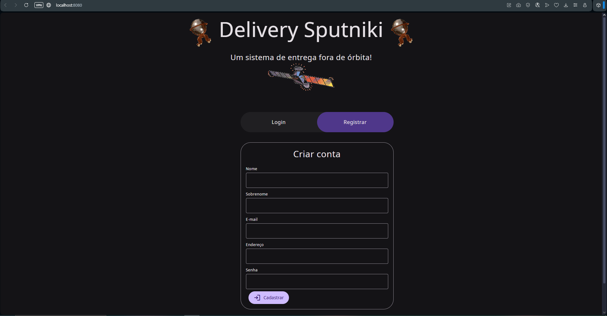
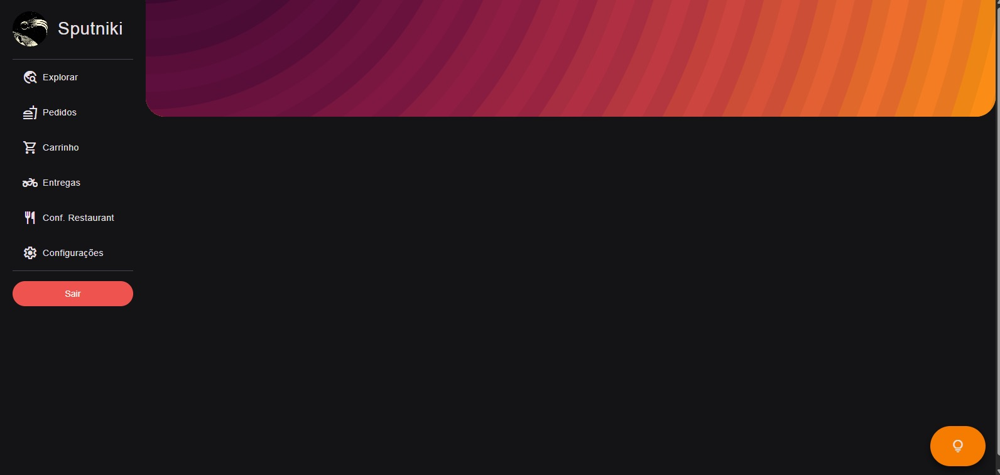

# Delivery Sputniki
Projeito feito em PHP para a aula do professor Wendel

**Ferramentas usadas:**
- 
- **Framework:** Code igniter4
- **Banco de dados:** MySQL
- **Servidor:** Apache (WAMP)
- **UI:** Beer.css (Material Design 3)
- **Inspiração:**: minha familia meus pais minhas irmãs e todos desse planeta terra ai

**Criado por:** joao pedro (silva) & Ana "Schin" Beatriz 